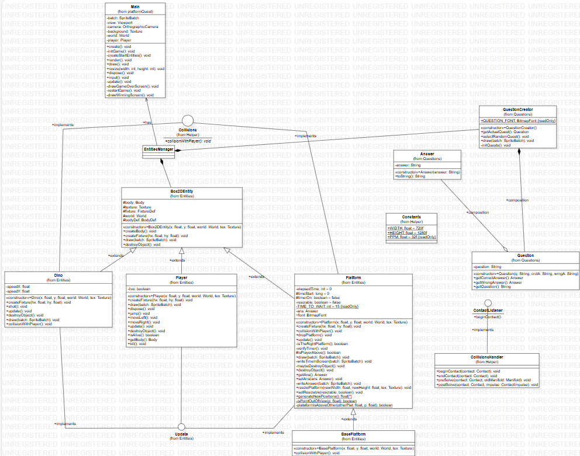

# PlatformQuest
**Nome:** Nicholas Zortea Graczik
**Curso:** Sistemas de Informação
**Ano:** 2024
## Proposta do Jogo
O objetivo do jogo é pular em plataformas que representam as respostas para a pergunta sendo mostrada ao jogador. As perguntas têm como base o Geoparque da Quarta Colônia. E cada pergunta sempre possui 2 respostas possíveis, portanto 2 plataformas.

### Mecânicas

#### Controles
| Tecla      | Movimento          |
|------------|--------------------|
| **↑**      | Pular    |
| **←**      | Mover para a esquerda |
| **→**      | Mover para a direita |
|**R**|Reinicia(somente quando morto ou vitorioso)|

#### Plataforma Base
Quando o jogador inicia o jogo, ele inicia sob uma plataforma "base" cuja largura preenche a tela. Essa plataforma ao ser tocada inicia um timer de 15 sec, que ao terminar faz com que a mesma despenque.

#### Plataformas como respostas
Quando o jogador seleciona uma plataforma, ela é a resposta para uma pergunta, caso represente a pergunta certa, o timer de queda é iniciado e ela se "transforma" em uma plataforma base, ficando com a largura da tela, além disso, duas novas plataformas são geradas acima do jogador com uma posição(em relação ao eixo horizontal) pseudo-randômica e uma nova pergunta é sorteada para elas.
Caso a plataforma selecionada seja a com a pergunta errada, a mesma despenca.

#### Dinossauros
A cada interação do jogo um int entre (0 e 5)(5 não incluso) é gerado pseudo-randomicamente. Esse inteiro vai representar o tempo para lançar um novo dinossauro. Enquanto o tempo de lançamento avança não é possível gerar mais dinossauros. O Dinossauro será gerado em uma posição acima e pseudo-randômica em relação ao jogador. O dinossauro vai iniciar com uma velocidade linear em direção ao jogador(será jogado contra o jogador). Os dinossauros podem colidir com as plataformas, com o jogador, e com outros dinossauros. Se a colisão for com o jogador, isso resulta na derrota do mesmo.

#### Formas de morrer
Como supracitado, uma das formas de morrer é colidir com um dinossauro, a outra é quando o timer da plataforma abaixo do jogador chega a 0 e o jogador cai para fora da tela(mais especificamente quando jogador.y < 0).

#### Morri e agora?
Após morrer, será mostrada uma tela informando sobre e o jogador pode pressionar a letra "R" para recomeçar o jogo.

#### Como Ganhar
Para que o jogador consiga vencer, basta responder a todas as perguntas sem cair das plataformas ou ser morto pelos dinossauros.

## Arquitetura

### Física - Box2D
Como forma de implementar física aos meus objetos e texturas, utilizei a biblioteca Box2D, ela simula diversos aspectos da realidade, como fricção, densidade, velocidade, massa, coeficiente de restituição... Através de "corpos" que possuem uma formato (polígono, círculo,...)

#### Metros ou pixels?
Um dos "problemas" que eu encontrei foi o fato da Box2D não utilizar pixels como medida básica e sim "metros", então é necessário realizar uma conversão que representa quantos pixels são necessários para representar 1 metro. No meu caso cada 1 m possui 32 pixels, como a tela que eu crio é 720x1280px, em metros ela fica com 22.5x40m.

#### "Entidades físicas"
Para criar um objeto que possui física, é necessário criar um corpo, uma forma, uma "fixture" que representa as propriedades como densidade, fricção e adicionar esse objeto em um "world" (que possui gravidade), também é necessário definir o "tipo" de corpo, que podem ser dynamic, static e kinematic.

### Classes "talvez mais importantes"

#### Box2DEntity
Essa classe representa tudo que um objeto com física precisa ter, corpo, formato, textura e outras propriedades. Portanto, todas classes que criei com física (Platform, Dino, BasePlatform, Player) extendem a ela.

#### EntitiesManager
A classe EntitiesManager é uma das mais importantes do projeto, ela segue o padrão Singleton e guarda todas as entidades presentes no jogo através de uma lista de Box2DEntity, ela também possui uma fila de Runnables que servem como funções callback, que só podem ser executadas depois da atualização do mundo.

#### CollisionsHandler
Essa é uma classe importante para o sistema de colisões, ela implementa a interface ContactListener e "escuta" quando uma colisão entre objetos acontece, identificando os dois objetos envolvidos na colisão.

#### QuestionCreator
Essa classe é quem gerencia as perguntas, ela quando criada possui uma lista hardcoded com todas as perguntas do jogo, também possui um método que seleciona aleatoriamente uma dessas perguntas e "seta" como a pergunta atual, juntamente com um método que retorna a pergunta atual.

## Resultado final em um diagrama

### Dificuldades

#### Texturas X objetos físicos
Eu demorei um tempo relativo para conseguir sincronizar a textura da imagem com seu corpo físico do Box2D, isso se deve pela necessidade de ficar convertendo pixels de metros e de metros para pixels e também por que ao solicitar o ponto de um objeto físico, (body.getPosition()) o ponto retornado era em relação ao centro da figura geométrica, enquanto que ao tratar e desenhar texturas, o ponto inicial é na origem da textura, ou seja o ponto mais a esquerda e mais pra baixo da textura. Felizmente o Box2D possui uma classe chamada **Box2DDebugRenderer** que desenha visualmente os corpos físicos, o chatGpt me informou isso a partir do prompt "como posso ver o body? o meu player agora não está aparecendo mais". Assim pude realizar ajustes até que a textura e o corpo físico se alinhassem.

#### Pulo do jogador
Esse ainda é um tema sensível, pois o jogo ainda não está com o pulo da forma que eu desejo. Minha preocupação inicial era fazer com que o player não pudesse ficar pulando infinitamente, o que nas primeiras versões acontecia. Diante disso, criei uma condição para que o player apenas pule quando sua velocidade linear no eixo y é igual a 0, dessa forma sei que o player está parado. No entanto, percebe-se que o comportamento do pulo têm alguns defeitos, como demorar para pular. Havia pensado em criar uma flag que ao detectar colisão entre uma plataforma e o player passa para verdadeira, permitindo o pulo, e ao detectar o fim de uma colisão (através do método endContact() da interface ContactListener) setasse a flag para false, impedindo o pulo, mas isso ficou pior, fazendo com que em alguns casos o jogador não conseguisse mais pular.

#### "Avançar de nível"
Um problema que tive na minha ideia inicialmente seria como tornar possível para que o jogador avançasse através das plataformas. Visto que poderiam existir casos em que a plataforma correta ficasse diretamente acima do jogador e a partir disso eu precisaria fazer cálculos para gerar posições para as plataformas que tornassem possível o jogador chegar até acima delas. Diante disso cheguei na ideia de estender a plataforma correta.

#### "jogo estático X jogo dinâmico"
Como eu não queria um jogo onde eu precissase realizar um "level design" tentei fazer com que as coisas fossem geradas aleatoriamente seguindo alguns critérios. Isso trouxe algumas complicações, principalmente no desenho das respostas, pois as respostas são geradas pseudo-randomicamente com base em um vetor de perguntas. Calcular a posição correta das respostas em relação as plataformas foi algo difícil o qual tive que recorrer ao chat gpt com o seguinte prompt "Como fazer com que a escrita nunca saia da tela vísivel e esteja centralizada?". No entanto, mesmo com o código gerado pelo chatgpt, essa ainda precisa de polimento.

## Referências

#### Créditos:
[música de fundo](https://freesound.org/people/TiagoThanos/sounds/583100/)
[como criar fontes](https://libgdx.com/wiki/tools/hiero)
[Evitar que bodys girem](https://stackoverflow.com/questions/14537066/prevent-body-from-rotating-in-box2d)
[doc do Box2D](https://box2d.org/)

#### Prompts(alguns):
"Como fazer com que a escrita nunca saia da tela vísivel e esteja centralizada?"
"como eu posso definir a massa de uma entidade no box2d"
"Compiling module br.com.platformQuest.GdxDefinition
   Tracing compile failure path for type 'br.com.platformQuest.Questions.QuestionCreator'
      [ERROR] Errors in 'file:/C:/Users/zorte/Documents/paradigmas/trabFinal/core/src/main/java/br/com/platformQuest/Questions/QuestionCreator.java'
         [ERROR] Line 55: The method nextInt(int) in the type Random is not applicable for the arguments (int, int)
   [ERROR] Aborting compile due to errors in some input files"
"implementações de Queue para o java 17"
"Assertion failed: m_world->IsLocked() == false, file /home/runner/work/libgdx/libgdx/extensions/gdx-box2d/gdx-box2d/jni/Box2D/Dynamics/b2Body.cpp, line 115"
"Como posso tornar o meu jogo de plataforma infinito para cima?"
"Como eu posso centralizar a textura com o body? "
